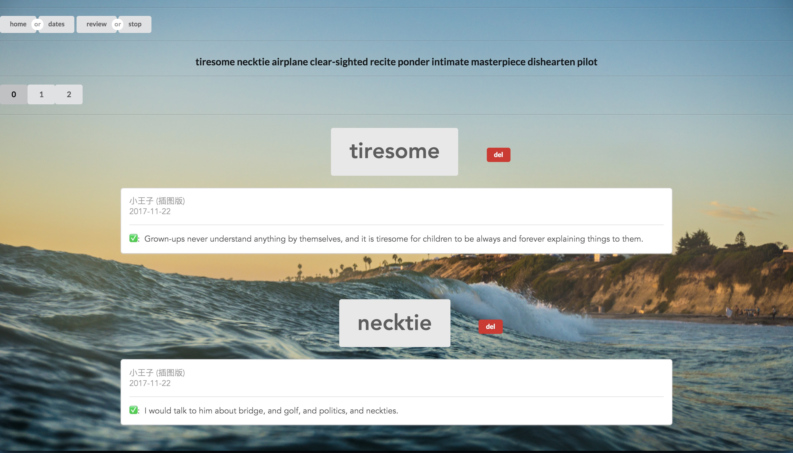

# Awesome Tool for Learning English

## What is it?

Captain is a smart clipboard recorder, a dictionary and a vocabulary builder
which is created for learning English.

## Features

### 1. Smart Clipboard Recorder

Captain monitors the clipboard and extracts the word and the sentence which the
word exists wisely. Why? Because it is essential to record the word and the
sentence in which you stuck and can't recognize when you read English articles
or English novels. If you can learn words from a vivid or meaningful sentence in
which you stuck other than a trivial example from a dictionary, you would gain
much efficiency when learning English.

### 2. Word Prototype

Caption could automatically obtain prototype of a word from a derived form. And
this is crucial for subsequent function. After all, you would probably want to
query word 'get' other than 'got'.

### 3. Automatic pronunciation

Want to listen to word pronunciation but too lazy to open other app and click
pronunciation button? Or even worse you have to open a web browser and search
the certain word manually? How can you bear the low efficiency? Now, you have
Caption, Captain would release you from the annoying dilemma. The only thing you
need to do is to copy the word, and the pronunciation would automatically be
emitted. And it is necessary here to declare that all of the pronunciations are
downloaded from http://dictionary.cambridge.org/, so thanks for their great work
sincerely.

### 4. Automatic notification

Just like automatic pronunciation, when you finished the step of copying a word,
after a short time, the word definition would pop up with the form of
notification. Cool!

### 5. Kindle Exporter

For convenience, Captain is able to automatically export the words in 'mastered'
category on Kindle vocabulary builder to a local file, and it will delete those
on Kindle and synchronize to Kindle. But currently, you need manually reboot
Kindle after exporting to make change valid.

### 6. Review Words Learned

For memorizing words learned in a convenient way, Captain supports a deliberate
approach to help you which selects word randomly from the words you learned to
present at a random time within an hour.

### 7. Dictionary

Captain, of course, is able to look up words. As a matter of fact, Captain
requests and gets word definition from website http://dict.youdao.com/, then it
will record the definition in a local dictionary file. so thanks for youdao's
great work sincerely.

### 8. Vocabulary Builder

Captain is originally designed as an assistant partner of Kindle
E-reader.Frankly, I think Kindle is awesome to learning English. When we look up
words on Kindle, they are automatically added to the Vocabulary Builder on the
device. With Vocabulary Builder, we can use flashcards to learn the definitions
and usage of words. But as a long term user, I think Kindle has a serious
shortcoming which is a lack of excellent management functionary of vocabulary
builder, and this is why I created this project originally.



## Install requirements

```
sh install.sh
```

## Requirements

OS: macOS
Browser: Chrome should be installed.

## Running the app

    sh rerun.sh

Open your browser, enter the url http://127.0.0.1:9527/learn_english.

## How to use

Once you have done the above steps. You can use now.

For recording the vocabulary and the sentence where you stuck, first you should
copy the word and then the sentence in which the word reside. That's all you
need to do. Now the word has been stored properly associated with its
definition, you can access and review at http://127.0.0.1:9527/learn_english.

For exporting the vocabulary which in category 'mastered' on Kindle, you just
need to plug in you Kindle and issue the command `sh run.sh` or if you have
executed that command, you should issue `sh rerun.sh` instead.

For listening to word pronunciation, copy the word outright. Then the
pronunciation would continually ring out for four times.

Captain works perfectly with a Chrome plguin which is called "Auto Copy", and the address is "https://chrome.google.com/webstore/detail/bijpdibkloghppkbmhcklkogpjaenfkg"

## Feedback

This is an early project and there will be breaking changes. However,
discussions and contributions are welcome. Please feel free to experiment and
come back with suggestions/issues to make this project more useful and more
powerful. Thanks.

## Contributing

Contributions are welcome!

## License

BSD 3-Clause License

Copyright (c) 2017, leo wu
All rights reserved.

Redistribution and use in source and binary forms, with or without
modification, are permitted provided that the following conditions are met:

* Redistributions of source code must retain the above copyright notice, this
  list of conditions and the following disclaimer.

* Redistributions in binary form must reproduce the above copyright notice,
  this list of conditions and the following disclaimer in the documentation
  and/or other materials provided with the distribution.

* Neither the name of the copyright holder nor the names of its
  contributors may be used to endorse or promote products derived from
  this software without specific prior written permission.

THIS SOFTWARE IS PROVIDED BY THE COPYRIGHT HOLDERS AND CONTRIBUTORS "AS IS"
AND ANY EXPRESS OR IMPLIED WARRANTIES, INCLUDING, BUT NOT LIMITED TO, THE
IMPLIED WARRANTIES OF MERCHANTABILITY AND FITNESS FOR A PARTICULAR PURPOSE ARE
DISCLAIMED. IN NO EVENT SHALL THE COPYRIGHT HOLDER OR CONTRIBUTORS BE LIABLE
FOR ANY DIRECT, INDIRECT, INCIDENTAL, SPECIAL, EXEMPLARY, OR CONSEQUENTIAL
DAMAGES (INCLUDING, BUT NOT LIMITED TO, PROCUREMENT OF SUBSTITUTE GOODS OR
SERVICES; LOSS OF USE, DATA, OR PROFITS; OR BUSINESS INTERRUPTION) HOWEVER
CAUSED AND ON ANY THEORY OF LIABILITY, WHETHER IN CONTRACT, STRICT LIABILITY,
OR TORT (INCLUDING NEGLIGENCE OR OTHERWISE) ARISING IN ANY WAY OUT OF THE USE
OF THIS SOFTWARE, EVEN IF ADVISED OF THE POSSIBILITY OF SUCH DAMAGE.
CONNECTION WITH THE SOFTWARE OR THE USE OR OTHER DEALINGS IN THE SOFTWARE.
